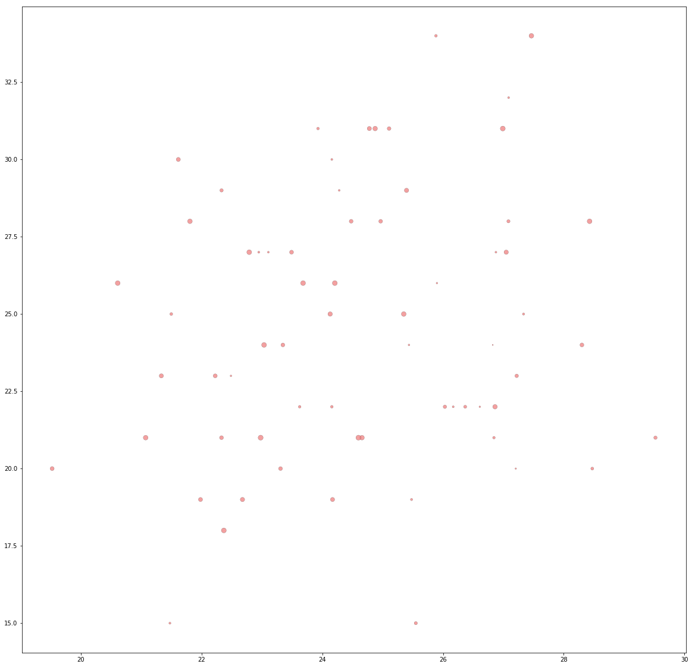

```python
# Dependencies
import matplotlib.pyplot as plt
import numpy as np
import pandas as pd
import seaborn as sns
import csv 
```


```python
ride_data = pd.read_csv("ride_data.csv")
ride_data.head()
```


<div>
<style>
    .dataframe thead tr:only-child th {
        text-align: right;
    }

    .dataframe thead th {
        text-align: left;
    }

    .dataframe tbody tr th {
        vertical-align: top;
    }
</style>
<table border="1" class="dataframe">
  <thead>
    <tr style="text-align: right;">
      <th></th>
      <th>city</th>
      <th>date</th>
      <th>fare</th>
      <th>ride_id</th>
    </tr>
  </thead>
  <tbody>
    <tr>
      <th>0</th>
      <td>Sarabury</td>
      <td>2016-01-16 13:49:27</td>
      <td>38.35</td>
      <td>5403689035038</td>
    </tr>
    <tr>
      <th>1</th>
      <td>South Roy</td>
      <td>2016-01-02 18:42:34</td>
      <td>17.49</td>
      <td>4036272335942</td>
    </tr>
    <tr>
      <th>2</th>
      <td>Wiseborough</td>
      <td>2016-01-21 17:35:29</td>
      <td>44.18</td>
      <td>3645042422587</td>
    </tr>
    <tr>
      <th>3</th>
      <td>Spencertown</td>
      <td>2016-07-31 14:53:22</td>
      <td>6.87</td>
      <td>2242596575892</td>
    </tr>
    <tr>
      <th>4</th>
      <td>Nguyenbury</td>
      <td>2016-07-09 04:42:44</td>
      <td>6.28</td>
      <td>1543057793673</td>
    </tr>
  </tbody>
</table>
</div>


```python
city_data = pd.read_csv("city_data.csv")
city_data.head()
```


<div>
<style>
    .dataframe thead tr:only-child th {
        text-align: right;
    }

    .dataframe thead th {
        text-align: left;
    }

    .dataframe tbody tr th {
        vertical-align: top;
    }
</style>
<table border="1" class="dataframe">
  <thead>
    <tr style="text-align: right;">
      <th></th>
      <th>city</th>
      <th>driver_count</th>
      <th>type</th>
    </tr>
  </thead>
  <tbody>
    <tr>
      <th>0</th>
      <td>Kelseyland</td>
      <td>63</td>
      <td>Urban</td>
    </tr>
    <tr>
      <th>1</th>
      <td>Nguyenbury</td>
      <td>8</td>
      <td>Urban</td>
    </tr>
    <tr>
      <th>2</th>
      <td>East Douglas</td>
      <td>12</td>
      <td>Urban</td>
    </tr>
    <tr>
      <th>3</th>
      <td>West Dawnfurt</td>
      <td>34</td>
      <td>Urban</td>
    </tr>
    <tr>
      <th>4</th>
      <td>Rodriguezburgh</td>
      <td>52</td>
      <td>Urban</td>
    </tr>
  </tbody>
</table>
</div>


```python
df = pd.merge(ride_data, city_data, how="outer",on="city", sort=True)
df.head()
```


<div>
<style>
    .dataframe thead tr:only-child th {
        text-align: right;
    }

    .dataframe thead th {
        text-align: left;
    }

    .dataframe tbody tr th {
        vertical-align: top;
    }
</style>
<table border="1" class="dataframe">
  <thead>
    <tr style="text-align: right;">
      <th></th>
      <th>city</th>
      <th>date</th>
      <th>fare</th>
      <th>ride_id</th>
      <th>driver_count</th>
      <th>type</th>
    </tr>
  </thead>
  <tbody>
    <tr>
      <th>0</th>
      <td>Alvarezhaven</td>
      <td>2016-04-18 20:51:29</td>
      <td>31.93</td>
      <td>4267015736324</td>
      <td>21</td>
      <td>Urban</td>
    </tr>
    <tr>
      <th>1</th>
      <td>Alvarezhaven</td>
      <td>2016-08-01 00:39:48</td>
      <td>6.42</td>
      <td>8394540350728</td>
      <td>21</td>
      <td>Urban</td>
    </tr>
    <tr>
      <th>2</th>
      <td>Alvarezhaven</td>
      <td>2016-09-01 22:57:12</td>
      <td>18.09</td>
      <td>1197329964911</td>
      <td>21</td>
      <td>Urban</td>
    </tr>
    <tr>
      <th>3</th>
      <td>Alvarezhaven</td>
      <td>2016-08-18 07:12:06</td>
      <td>20.74</td>
      <td>357421158941</td>
      <td>21</td>
      <td>Urban</td>
    </tr>
    <tr>
      <th>4</th>
      <td>Alvarezhaven</td>
      <td>2016-04-04 23:45:50</td>
      <td>14.25</td>
      <td>6431434271355</td>
      <td>21</td>
      <td>Urban</td>
    </tr>
  </tbody>
</table>
</div>


```python
# #avg fare per type of city

# df.groupby("type")["fare"].mean()

```


```python
# avg_fare_per_city = df.groupby(["type", "city"])["fare"].mean()
```


```python
# driver_per_city = df.groupby(["type", "city"]).driver_count.count()
# driver_per_city
```


```python
# rides_per_city = df.groupby(["city"]).driver_count.count()
# rides_per_city
```


```python
# avg_fare_per_city["Urban"]
```

BUBBLE PLOTS


```python
urban = df.loc[df["type"] == "Urban"]

suburban = df.loc[df["type"] == "Suburban"]

rural = df.loc[df["type"] == "Rural"]


```

------URBAN--------


```python
#y-axis
#Average Fare ($) Per City
urban_fare = urban.groupby(["city"]).mean()["fare"]
urban_fare.shape()

```


    ---------------------------------------------------------------------------

    TypeError                                 Traceback (most recent call last)

    <ipython-input-21-d571390f9062> in <module>()
          2 #Average Fare ($) Per City
          3 urban_fare = urban.groupby(["city"]).mean()["fare"]
    ----> 4 urban_fare.shape()
    

    TypeError: 'tuple' object is not callable


```python
urban.head()
```


<div>
<style>
    .dataframe thead tr:only-child th {
        text-align: right;
    }

    .dataframe thead th {
        text-align: left;
    }

    .dataframe tbody tr th {
        vertical-align: top;
    }
</style>
<table border="1" class="dataframe">
  <thead>
    <tr style="text-align: right;">
      <th></th>
      <th>city</th>
      <th>date</th>
      <th>fare</th>
      <th>ride_id</th>
      <th>driver_count</th>
      <th>type</th>
    </tr>
  </thead>
  <tbody>
    <tr>
      <th>0</th>
      <td>Alvarezhaven</td>
      <td>2016-04-18 20:51:29</td>
      <td>31.93</td>
      <td>4267015736324</td>
      <td>21</td>
      <td>Urban</td>
    </tr>
    <tr>
      <th>1</th>
      <td>Alvarezhaven</td>
      <td>2016-08-01 00:39:48</td>
      <td>6.42</td>
      <td>8394540350728</td>
      <td>21</td>
      <td>Urban</td>
    </tr>
    <tr>
      <th>2</th>
      <td>Alvarezhaven</td>
      <td>2016-09-01 22:57:12</td>
      <td>18.09</td>
      <td>1197329964911</td>
      <td>21</td>
      <td>Urban</td>
    </tr>
    <tr>
      <th>3</th>
      <td>Alvarezhaven</td>
      <td>2016-08-18 07:12:06</td>
      <td>20.74</td>
      <td>357421158941</td>
      <td>21</td>
      <td>Urban</td>
    </tr>
    <tr>
      <th>4</th>
      <td>Alvarezhaven</td>
      <td>2016-04-04 23:45:50</td>
      <td>14.25</td>
      <td>6431434271355</td>
      <td>21</td>
      <td>Urban</td>
    </tr>
  </tbody>
</table>
</div>


```python
#x-axis
urban_rides = urban.groupby(["city"]).count()["driver_count"]
urban_rides.shape
```


    (66,)


```python
#size of the circles

urban_driver_count = urban.groupby(["city"]).mean()["driver_count"]
urban_driver_count.shape

```


    (66,)


--------SUBURBAN---------


```python
#y-axis
#Average Fare ($) Per City
suburban_fare = suburban.groupby(["city"]).mean()["fare"]

```


```python
suburban_fare.head()
```


    city
    Anitamouth      37.315556
    Campbellport    33.711333
    Carrollbury     36.606000
    Clarkstad       31.051667
    Conwaymouth     34.591818
    Name: fare, dtype: float64


```python
#suburban x-axis

suburban_rides = suburban.groupby(["city"]).count()
suburban_rides.head()
```


<div>
<style>
    .dataframe thead tr:only-child th {
        text-align: right;
    }

    .dataframe thead th {
        text-align: left;
    }

    .dataframe tbody tr th {
        vertical-align: top;
    }
</style>
<table border="1" class="dataframe">
  <thead>
    <tr style="text-align: right;">
      <th></th>
      <th>date</th>
      <th>fare</th>
      <th>ride_id</th>
      <th>driver_count</th>
      <th>type</th>
    </tr>
    <tr>
      <th>city</th>
      <th></th>
      <th></th>
      <th></th>
      <th></th>
      <th></th>
    </tr>
  </thead>
  <tbody>
    <tr>
      <th>Anitamouth</th>
      <td>9</td>
      <td>9</td>
      <td>9</td>
      <td>9</td>
      <td>9</td>
    </tr>
    <tr>
      <th>Campbellport</th>
      <td>15</td>
      <td>15</td>
      <td>15</td>
      <td>15</td>
      <td>15</td>
    </tr>
    <tr>
      <th>Carrollbury</th>
      <td>10</td>
      <td>10</td>
      <td>10</td>
      <td>10</td>
      <td>10</td>
    </tr>
    <tr>
      <th>Clarkstad</th>
      <td>12</td>
      <td>12</td>
      <td>12</td>
      <td>12</td>
      <td>12</td>
    </tr>
    <tr>
      <th>Conwaymouth</th>
      <td>11</td>
      <td>11</td>
      <td>11</td>
      <td>11</td>
      <td>11</td>
    </tr>
  </tbody>
</table>
</div>


```python
#size of circles

suburban_driver_count = suburban.groupby("city").count()["driver_count"]
```

-----------RURAL-----------


```python

#y-axis
#Average Fare ($) Per City
rural_fare = rural.groupby(["city"]).mean()["fare"]
```


```python
#suburban x-axis

rural_driver_count = rural.groupby("city").count()["driver_count"]

```


```python
#size of circles

rural_driver_count = rural.groupby("city").count()["driver_count"]
```


```python

plt.figure(figsize=(20,20))

plt.scatter(urban_fare, urban_rides, s=urban_driver_count, marker="o", c='lightcoral', label='Urban', alpha=0.75, edgecolor='black', linewidths=.2)
plt.show()


plt.scatter(suburban_fare, suburban_rides, s=suburban_driver_count, marker="o", c='skyblue', label='Suburban', alpha=0.75, edgecolor='black')
plt.show()

plt.scatter(rural_fare, rural_rides, s=rural_driver_count, marker="o", c='yellow', label='Rural', alpha=0.75, edgecolor='black')
plt.show()

plt.legend()
plt.xlabel('Number of Riders', size=14)
plt.ylabel('Average Fare ($)', size=14)
plt.title('Average Fare vs. Number of Riders by City Type', size=18)
plt.grid()
plt.show()
```





    ---------------------------------------------------------------------------

    ValueError                                Traceback (most recent call last)

    <ipython-input-33-551a716b9cd7> in <module>()
          6 
          7 
    ----> 8 plt.scatter(suburban_fare, suburban_rides, s=suburban_driver_count, marker="o", c='skyblue', label='Suburban', alpha=0.75, edgecolor='black')
          9 plt.show()
         10 


    ~/anaconda3/lib/python3.6/site-packages/matplotlib/pyplot.py in scatter(x, y, s, c, marker, cmap, norm, vmin, vmax, alpha, linewidths, verts, edgecolors, hold, data, **kwargs)
       3355                          vmin=vmin, vmax=vmax, alpha=alpha,
       3356                          linewidths=linewidths, verts=verts,
    -> 3357                          edgecolors=edgecolors, data=data, **kwargs)
       3358     finally:
       3359         ax._hold = washold


    ~/anaconda3/lib/python3.6/site-packages/matplotlib/__init__.py in inner(ax, *args, **kwargs)
       1708                     warnings.warn(msg % (label_namer, func.__name__),
       1709                                   RuntimeWarning, stacklevel=2)
    -> 1710             return func(ax, *args, **kwargs)
       1711         pre_doc = inner.__doc__
       1712         if pre_doc is None:


    ~/anaconda3/lib/python3.6/site-packages/matplotlib/axes/_axes.py in scatter(self, x, y, s, c, marker, cmap, norm, vmin, vmax, alpha, linewidths, verts, edgecolors, **kwargs)
       4017         y = np.ma.ravel(y)
       4018         if x.size != y.size:
    -> 4019             raise ValueError("x and y must be the same size")
       4020 
       4021         if s is None:


    ValueError: x and y must be the same size


```python


```


```python
# Total Number of Rides Per City

rides_per_city = df["city"].value_counts()
rides_per_city
```


```python

# Total Number of Drivers Per City


each city = 
```


```python

# City Type (Urban, Suburban, Rural)


```

PIE CHARTS


```python
# % of Total Fares by City Type

colors = ['gold', 'lightskyblue', 'lightcoral']
explode = (0, 0, 0.1)
plt.figure(figsize=(6,6))
plt.pie(['total_fare'], labels=['type'], colors=colors, autopct='%1.1f%%', explode=explode, shadow=True, startangle=90)
plt.axis('equal')
plt.title('Fare Total by City Type\n', size=18)
plt.show()


```


```python
# % of Total Rides by City Type
```


```python
# % of Total Drivers by City Type
```
